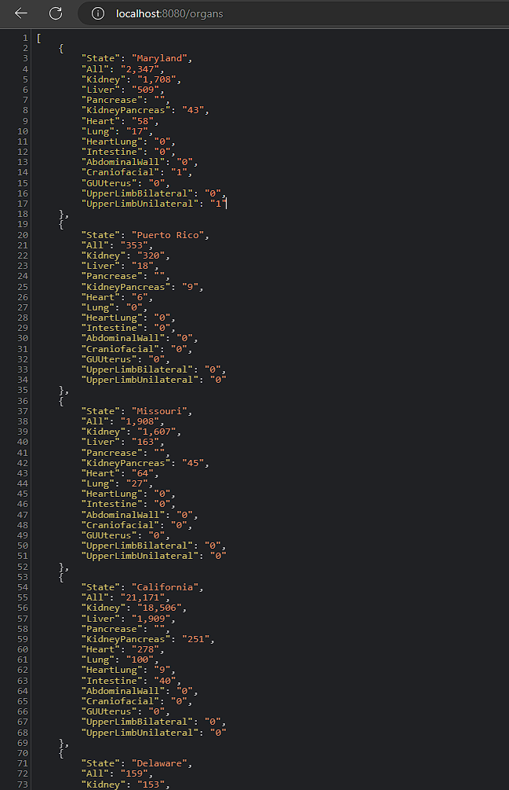

# Organs Demo

## This is a demo of a Go/Gin REST api that delivers national Organ Donor waitlist data for use in visualizations
- The data is from [OPTN](https://optn.transplant.hrsa.gov/data/view-data-reports/national-data/)
- It has been dumped to CSV and imported into Firebase and is not real-time
- To run this application requires the Firebase api-key.json which is not provided here

The output looks like this: 

